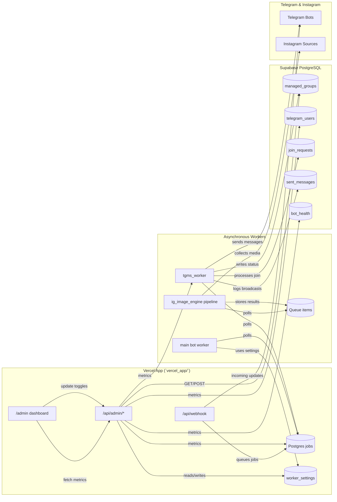

# System Layout with Admin Dashboard

## Notes
- **Operations**: Dashboard pulls metrics via `/api/admin/dashboard/metrics` and updates toggles through `/api/admin/worker-settings` in `vercel_app/api/webhook.py`.
- **Workers**: Main worker and `tgms_worker` consume jobs from the shared `jobs` table; the image engine reads `queue_items` for scoring tasks.
- **Storage**: Supabase tables include `managed_groups`, `telegram_users`, `join_requests`, `sent_messages`, `bot_health`, and `worker_settings`.
- **External Integrations**: Telegram supplies updates to the webhook and receives bot responses; the image engine scrapes and processes Instagram media.
